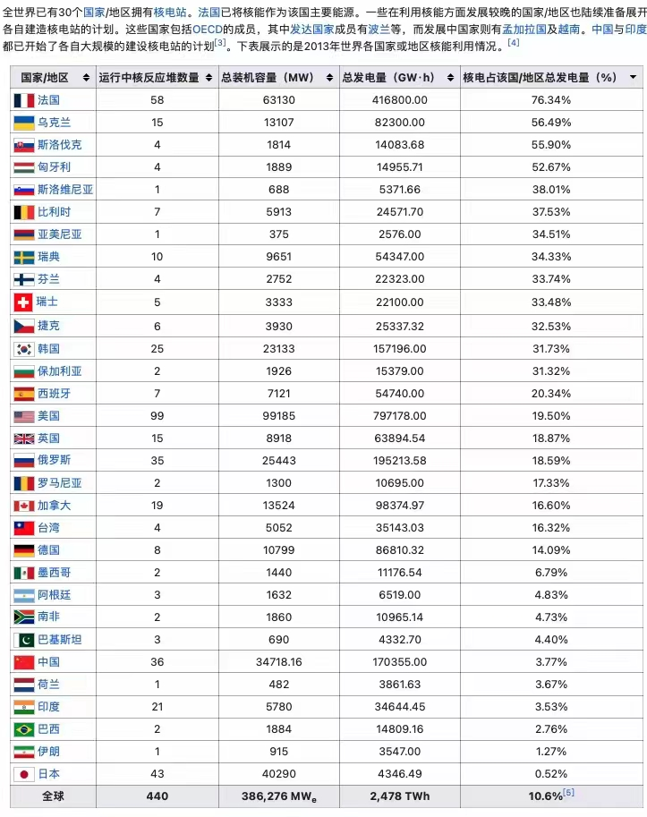

<!-- TOC -->
* [写在前面](#)
* [10. 割裂的世界 20220906](#10--20220906)
* [9. 美国持续繁荣的保障之一 ——托拉斯与反托拉斯 20220904](#9---20220904)
* [8. 美国总统山的各位总统 20220903](#8--20220903)
* [7. 假如现在的病毒回到三年前 20220903](#7--20220903)
* [6. 清朝的辫子 20220902](#6--20220902)
* [5.中国两千多年了，本质仍是没有改变 20220831](#5-20220831)
* [4.农村人淳朴以及穷山恶水出刁民 20220829](#4-20220829)
* [3.汝州怪鱼的寓言及我的解读 202208028](#3-202208028)
* [2.中医连感冒都治不好，就别指望治疗其他病了 20220828](#2-20220828)
* [🤔1.最近停电的一点想法 20220816](#1-20220816)
<!-- TOC -->

# 写在前面
记录点想法，见证自己三观，思想会不会更新

我是一个坚定的科学主义者，我认为只有科学才能拯救人类，人类出现了科学之后，才开始大幅进步，各项成果甚至是指数型增长

科学不是结论，他是一个工具，是我们认知世界的手段，是经过一系列推导论证，严密的推理得出来的认为最接近世界真相的工具

# 13. 法治与法制 20220925
法治与法治这两个有着根本上的区别。法制讲只要有法律制度，至于怎么执行不管，这样就导致法其实是形式主义，最终还是人治；而法治，是要讲究依法进行处罚。按照这个标准，我们属于法制还是法治呢？

法治出现于西方或者说西欧，他是一个契约。

如果要实行法治，需要市场经济做支撑。市场经济讲究两点。
1. 财产主权划分。这个东西是谁的。而财产主权划分又需要法律保障。所以鸡生蛋蛋生鸡
2. 公买公卖。东西是有价格，买定离手。不是我孝敬你的

这如果能正常执行，当有人有了财产之后，那么必定又回回到一点，我的钱怎么保证是我的，私有财产神圣不可侵犯。

而当私有财产神圣不可侵犯落实，那我就不担心别人随意将我财产拿走。而当人有了财产之后，经济独立，就不必看别人脸色下菜，我想干啥就干啥，那就会有自由，言论自由，思想自由。像之前罗永浩怼王自如："被包养你跟我谈论自由我都觉得好笑"

但是自由不是绝对的，必须要有限制，而这个限制，就是契约
西方有几个契约：
1. 人与人约定，这个是法律。所有人签订一个契约，不应该做什么，做了坏事就应该受到惩罚
2. 人与自然约定。1+1=2，平面上两点之间，直线最短。这个是公理。由公理推导出来的叫定理，定理再经过一系列推理得出的结论叫假说，而假说被验证之后叫真理。但真理不代表一定正确，而只是现在现象表明这个是正确的
3. 人与上帝约定。这个就构成了道德标准。生前尽量多做好事，少做坏事。好事做得多，死后上天堂；否则下地狱

而上帝是个假的，只是自己心中的标准，你不遵守，也没有谁惩罚你。只会有自己惩罚自己，比如内疚

1. 契约面前人人平等
2. 法律面前人人平等
3. 真理面前人人平等
4. 上帝面前人人平等

如果多了解就知道，我们的法律实际形同虚设。而这个是现代与传统社会很重要的划分。权力无限大，我能干出啥事我自己都不知道。只有你想不到，没有我做不到

# 12. 关于最近几天朋友圈的沉默 20220917
> 如果尖锐的批评完全消失，温和的批评将会变得刺耳。如果温和的批评也不被允许，沉默将被认为居心叵测。如果沉默也不再允许，赞扬不够卖力将是一种罪行。如果只允许一种声音存在，那么，唯一存在的那个声音就是谎言。

近段时间各种言论管控非常严，在某些地方也看到了各种真相以及各种黑暗乱象。原以为是最近变了，会慢慢变好的，突然发现其实一直都是如此，从未改善。

我觉得特别好笑的是我同事，之前一直坚定清零。后来被关了十几天不到半个月，就变了

我真觉得这种人真是傻逼，他么的铁拳不砸到自己头上是不知道痛。他么的就被封了十几天就受不了了，人家上海，伊犁，瑞丽(其他地区就不列举了),各种地方被封了几个月半年的，吃不上饭的，你当初怎么不替人家说话，没饭吃了，还要怪人家矫情。

那些叫嚣坚定不移支持的，一部分是既得利益，一部分是上位者。根本不需要工作，根本不会没钱没吃的。一部分就是底层的傻逼。他妈的马上饿死了，还不知道是谁的问题，还要怪老天爷怎么这样对你。

索性朋友圈也不更新了，傻逼是叫不醒的，都随他们吧，与我无关。

# 11. 华为与苹果发布会 20220912
华为发布了 Mate50 系列手机，主打高端，但真的乏善可陈。我是真没看明白怎么有勇气卖那么贵对标苹果的

发布会上对标苹果，好的参数与 iPhone13 Pro 比较，但是也仅限某些用户不关心的东西，用户关心的东西倒是一个没对标，没比较。因为一比那真的自取其辱

之前一直说买华为爱国，评论区一反驳每次就是 这是粉丝说的，不是华为说的。但我不知道为啥华为要在发布会上说昆仑，说就像昆仑的成为中华的脊梁，强行升华，真的尬。好好发布产品不行吗，我要为你的情绪买单吗？

一直嘲笑苹果的刘海，结果今年苹果没有刘海了，Mate50 Pro 倒是自己回到了刘海。华为是不可能不知道苹果今年是没有刘海了的，国外媒体早就爆料了，不知道为啥要舍弃挖空，开倒车对标苹果。

不过苹果不搞挖孔，坚持用刘海是有原因的。自己的 3D face 识别的传感器在刘海上，这项技术很牛批，13P 也只尽可能缩小了一些。其他手机因为没这个东西，所以可以只保留摄像头，搞个挖孔，然后疯狂嘲笑人家苹果。实际上是自己没那个技术搞 3D face(这个是苹果为啥坚持了那么多年的刘海的原因)

不过苹果今年的发布会有点令人失望。除了刘海改成了个💊，出了个灵动岛，虽然动画依旧牛皮，但是要应用适配。不知道会不会是下一个对大多数人鸡肋的 Touch Bar

摄像升级到 4800W 像素，应该是个大的升级。传闻中说支持 8K 视频拍摄没有，所以数据线仍然没有升级，估计也认为没有升级吧。(爆料说虽然仍是 lighting 但是带宽会升级，因为8K视频有点大)

处理器升级但是没和A15比，和A13比。估计因为性能提升没那么明显。(A13 差不多是高通骁龙现在的性能)

我订了个人生第一台 iPhone，14P 256g 深紫。但是还在犹豫要不要，因为提升感觉没太明显，而且明年还会改成 Type-C 接口，估计也是支持8K。爱国在我这里是行不通的，我只认哪个好看好用。

# 10. 割裂的世界 20220906
当接受不了质疑批评的人掌握了话语权,最终就只剩下溜须拍马的人了

现在质疑不能说，批评不能说，科学不能讲，法律不能讲，德先生反正也从来没讲过就直接忽略吧

环境越来越像厕所

底层还活在幻想和某些人编织的梦中，当梦破碎了甚至不知道该去骂谁，最终归咎老天爷和命

当你尝试叫醒他，告诉他真相可能跟梦不同时，他基本只会对你破口大骂，因为他没有什么其他本事，没有其他成就，只有活在别人给他编织的梦中，才会生出所谓的自豪感，回归现实落差太大了

然而现在各种魔幻的事情，已经让越来越多人的梦破碎了，叫醒他的不是身边的人，而是一顿顿铁拳。然后跑到网上哭诉，我那么相信你，为什么要这样对我

# 9. 美国持续繁荣的保障之一 ——托拉斯与反托拉斯 20220904
> 如果没有移民文化，托拉斯始于此，也将终于此，美国会继续西班牙、荷兰、英国的故事(世界级霸主然后衰落)，衰败在自己的繁荣中
> 
> 显然，20世纪初的美国人意识到了，托拉斯终于遇到了自己的死敌，反垄断。正因为如此，美国才没有堕入强国轮回的宿命

托拉斯是Trust，信托的音译。可以简单理解为能进行垄断公司

关于垄断
1. 对于一个企业来说，垄断肯定不是坏事。
2. 对于国家来说，有跨国大企业垄断也不是坏事。
3. 但是对于其他企业以及创业者来说，这是灾难。你不能把这个行业利润全都拿走，连口汤都不给新人。

当时的垄断对于美国
1. 挣得钱实在是太多了，洛克菲勒和摩根就占到了美国财富的三分之一，世界的十分之一
2. 托拉斯企业开始影响美国政治，左右议员
3. 财富集中在少数人手中。工人真的没有太多改善

所以，愤怒的人们开始联合抗议谴责。南方农民兄弟率先发难。之后1890年，共和党向国会提交了《反托拉斯法》，然后这个重大的法案几乎没有争论，52:1,绝对的压倒性优势通过了

但是，一开始只是人们觉醒了，在行动上并没有怎么开始。直到 西奥多·罗斯福，没错，就是昨天提到的总统山上的那个罗斯福

但是他并没有出相应法律，而之前的《反托拉斯法》有些又过于模糊，虽然有措施，但是很多起诉也失败了

直到后面的威尔逊，在威尔逊的授意下，议员向国会提交了《克莱顿反托拉斯法》。

而根据这个法案，J.P.摩根、洛克菲勒的标准石油公司、美国制糖公司等一批托拉斯纷纷解体

# 8. 美国总统山的各位总统 20220903
总统山总统分别为 华盛顿、 杰斐逊、老罗斯福(即西奥多·罗斯福，罗斯福新政那个富兰克林·罗斯福是他堂弟)、林肯

以上可以说美国历史上最具有突出贡献的几位总统，也代表了美国建国以来130年的历史

每一位都有独特的个人魅力

- 华盛顿，开国元勋之一，带领美国赢得了独立战争。美国第一任总统，两届任期之后坚决退位给第二任 约翰·亚当斯，为后面总统最多两届奠定了基础，(好像除了罗斯福四届，其他都是两届)
- 杰斐逊，开国元勋之一，《独立宣言》起草者之一，弗吉尼亚大学创办者。自己的墓志铭中给自己的定义是: 《独立宣言》起草者、弗吉尼亚《宗教自由法令》起草者、弗吉尼亚大学创办者(HERE WAS BURIED THOMAS JEFFERSON AUTHOR OF THE DECLARATION OF AMERICAN INDEPENDENCE OF THE STATUTE OF VIRGINIA FOR RELIGIOUS FREEDOM AND FATHER OF THE UNIVERSITY OF VIRGINIA).可见他对于当选总统这种事情一点都不在意
- 西奥多·罗斯福。国内的主要贡献是建立资源保护政策，保护了森林、矿物、石油等资源；建立公平交易法案，推动了劳工与资本家和解。对外奉行门罗主义，实行扩张政策，建设强大军队，干涉美洲事务。推动巴拿马运河建设，调停俄日战争，获得诺贝尔和平奖
- 林肯。南北战争，解放黑人，废除奴隶制

其他的伟大的总统还有 里根、富兰克林·罗斯福、克林顿

美国开国元勋(本杰明·富兰克林、华盛顿、杰斐逊等)，奠定了美国的基调——自由

# 7. 假如现在的病毒回到三年前 20220903
如果现在新冠的变种哪怕不是最新的这种连肺炎症状都没有的BA.4,BA.5, 就算是毒性稍强点的奥密克戎, 回到三年前的武汉，顶多说一句，"最近有新流感，大家注意防护即个人卫生"

# 6. 清朝的辫子 20220902

我毫不怀疑现在还有人怀念辫子与裹脚布

# 5.中国两千多年了，本质仍是没有改变 20220831

自从疫情见识到了各种魔幻的事情之后，越发对中国失去了信心。我不知道以后会怎么描述这段历史，十年动乱的延续？有老人说，现在甚至比以前更加魔幻

我们不需要德先生不需要赛先生，只需要谨遵圣旨的*才。从古至今只对上负责，明知道是错的，但是为了自己的乌纱帽，不作为谨遵圣旨就对了。毕竟贱民丢掉的是命，我丢掉的可是乌纱帽

1. 罔顾宪法规定。随意践踏人权，强制圈地，限制人身自由；私自撬锁入户，直接破门而入，私闯民宅；
2. 随意安置罪名，别问 问就是按照法律规定
3. 

# 4.农村人淳朴以及穷山恶水出刁民 20220829

> 我是坚信后者，不相信前者

先看下最近这个事件，再说我的观点

我相信看了这个之后，应该没有人再说民风淳朴了吧。当然我不是只通过这一个个例就来论证说 穷山恶水出刁民

农村不像大城市，大城市谁也不认识谁，讲究交易，一手交钱一手交货，我不太需要你的信用，你托我办事，不可能说给你个面子就免费帮你，你面子值几个钱。谁喜欢农村呢？**有威望的，有权有势的人**，因为他可以只凭面子，人情就能做你的人上人，做所谓的土皇帝。在大城市一线城市，你有钱也仅仅是有钱，你不会有太多特权(这个不包括官员)。实际上在大城市的基层官员远不如小农村的村长，之前不也有村长贪污一个小目标的新闻，在小农村他就是土皇帝，他就是天

你认为的民风淳朴等等，那是大概率因为你以前生活在农村，你周围的人你都认识，而且你跟他没有太多利益冲突，他们不会做的太出格，一旦有了利益冲突，他们可是一点亏都不会吃的，你认为的一点点不值钱的可能都看不上的东西，就能让他们丑态百出

拿我亲戚举例(我爸的亲兄弟姐妹)，我爸从农村出来做生意挣到了钱，想帮帮她，说借她 10W块钱，利息每年10%(我爸每年赚的远高于这个)，但是后面闹的很僵，支付了远高于之前的利息不说，还没落的好。她从老家农村去投奔我爸，我爸给她安排工作，包括她老公，后来他们走了也没念我爸的好。最近听说我弟在上海，还没有对象，她说给我弟介绍一个，实际上那个女孩条件非常差，我弟没看上，她还跟我爸生气，我是实在没想通，这个不是很正常吗，不可能介绍就一定要相处结婚吧。可能她觉得自己介绍的，我弟没看上，觉得驳了她的面子，让她有点难堪。

然后我爷爷生病，比较严重那种，我爸让她带去大医院，结果只去村上，病都没查出来，打几天水，耽误治疗，白白花钱。后来去大医院，要住院，我爸让她先垫上，后面转给他，她不愿意出钱。那个也是她自己亲爸爸。

后来我弟给我奶奶买了个银手镯，400块钱。因为我奶奶在他们家，联系方式就写的她，结果她就直接把手镯拿走了，装傻说是我弟给她买的。她肯定是知道买给谁的，因为问地址的时候说了给我奶奶买东西寄到她那里，还戴着到跑到街上到处炫耀。我弟想想也就400块钱，算了

其实理智想想也知道，农村很多是不知道什么叫私人财产，什么叫互惠。他只知道人情和关系。**没有任何法律常识，如果大家都这么做，他就会认为是对的。大家都不做，他也不一定认为是错的**

大同社会不可能出现在物质贫乏的古代

# 3.汝州怪鱼的寓言及我的解读 202208028  

不得不说真的大费周章

鱼这种入侵其实没有什么，首先你在公园的湖中，整个生态是封闭的，不像其他物种入侵，他是会活动的，你需要严防

寓意如下：
1. 为了不让鳄雀鳝杀死本地物种，我们先把他们都杀了
2. 抽干湖水对生态影响远远大于鳄雀鳝，但他可是鳄雀鳝啊，其他鱼都不是鱼
3. 虽然鳄雀鳝从科学上来说没多少威胁性，也没多少攻击性，但为了体现当地领导的英明神武，一定要将他的危害极具夸张，然后不惜一切代价抓住它。

以上请大家不要过度联想

# 2.中医连感冒都治不好，就别指望治疗其他病了 20220828
> 中医这个话题非常大，我后面会一点点说为啥从以前中医粉变成完全的中医黑
> 
> 首先记住以下几点，如果你去一个医院，只给你开了西药，没有各种中药中成药，那这个医院绝对是良心的
> 
> 如果医院给给你开了西药+中药中成药，只吃西药基本就行了，中药中成药就是骗你钱的
> 
> 如果医院只给你开了中药中成药，那你这个病根本没啥大不了的，几天后就会自愈
> 
> 所以给你开中药中成药，你就直接给医生说自己以前吃了中药中成药，过敏，差点死了，他就不会给你开了

其实没有中西医只说，只有现代和传统医学之分。以下中医指代传统医学，西医指代现代医学

对于中医，如果你自己思考，而不是只看宣传和周围人说什么，你就会发现这玩意儿就是骗人的东西。

很早之前我看到过一篇文章，说中医能治的病都是自愈性的病，连个感冒都治不好。我当时嗤之以鼻，这专家真能瞎几把说，如果是那样，为啥还能存在到现在

后来大三之后，我看了很多科普性质的书，所有领域基本都有，慢慢有了自己的思考，开始辩证看待某些事情，然后就开始怀疑中医。

以下就拿最简单的感冒说起，为啥中医连个感冒都治不好

为啥看个感冒要验血

感冒产生的原因一般分为两种，细菌性感染和病毒性感染。病毒性引起的一般会伴随细菌感染。比如我这次

以前去看感冒没有验血，只是不规范。说白了就是瞎几把整。不管你啥原因感冒都给你开一堆抗生素(你能药店买到的基本都是抗生素，头孢类，阿莫西林，左氧氟沙星等等)。而抗生素，对病毒性感染的根因——病毒是没有任何卵用的。但是你感觉有用，90%的原因是你的免疫系统，剩下的就是安慰剂作用，和小部分消灭了细菌，让你的症状看起来没那么严重，仅此而已。感冒了吃抗生素准有效，哪怕对病毒性感染效果不佳，所以每次感冒一般都会有抗生素药物

流感都是病毒感染引起的，没有例外。所以流感每次如果不去医院开正确的抗病毒的药物，只吃自己家里的抗生素，你只会感觉反反复复好不了，而且症状比一般感冒严重

像市面上能买到的号称抗病毒的，基本都是扯淡。抗病毒的药物基本都是处方药，而且都很贵，一般要去大医院医生结合你病情才能开的。什么三九，什么抗病毒胶囊口服液。要么违规添加，要么就是糖水。

所以为啥我说中医连个感冒都治不好，因为他连病因都找不到啊，还能给你瞎几把扯一堆治标治本，这不太魔幻了？而找不到病因，没法对症下药(就算找到病因，也没有中药是对症的)，所以效果就差啊，所以要你喝一两个星期的苦水啊，等你免疫系统把你治好了，就是苦水的功劳[好的][好的]

为啥我去北大深圳医院，去了两三次，从来没给我开过中药中成药，每个药价格都很便宜。中药有用，为啥不给你开中药呢？每次去医院为啥都是一堆西药再加一堆昂贵的中药？中药有用，为啥要给你开一堆便宜没用的西药呢，这个也捞不到钱啊，还要被国内的【碍国人士】说你崇洋媚外啊

# 🤔1.最近停电的一点想法 20220816
电不够了，就别鼓吹水电，风电，火电，太阳能电了。这几个从效率，对生态影响，清洁方面跟核电比就是弟中弟，没一个能打的

但是现在被没有什么科学素养的人掌握话语权甚至领导权，天天跑去宣传日本怎么倾泻核废料，整得谈核色变

核电技术现在已经四代了，目前在建的基本都是三代，大规模商用是二代。福岛是二代，切尔诺贝利是一代。一代比一代安全性方面强的多的多，而且之前灾害很多是人为导致的

只能看到直接影响，看不到间接影响导致的东西。建个水电，拦个大坝，看看三峡生态改了多少，还要指望老天爷赏饭。建个火电，空气质量下降，人均寿命缩短。当然这些没几个人会想。只会看到福岛，切尔诺贝利这种直接导致的生态问题

目前来说，只要不是俄罗斯这种没底线的，跑别人核电站旁边打仗的(目前知道的也就俄干过)，基本不会出现核问题

**科技才是第一生产力**

按照我们国家的体量，核电在30%才会是比较合理的，然而事实如下(13年数据，22年在5%)
